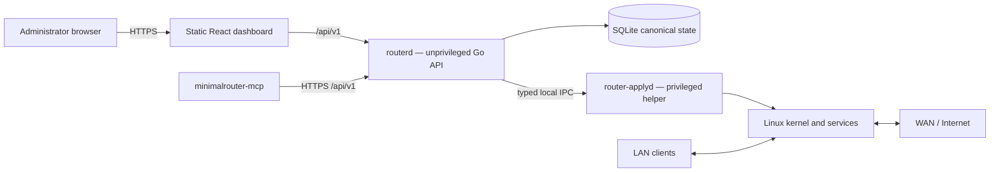
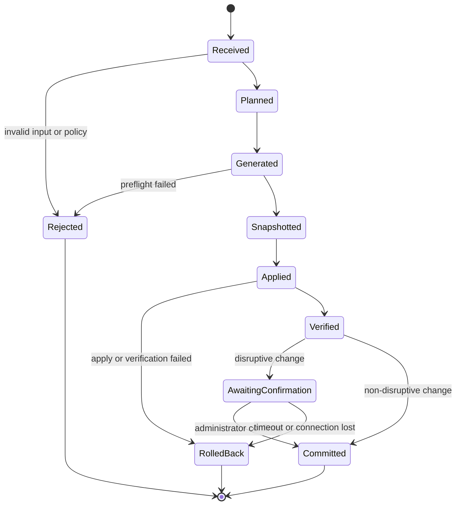

# Architecture

This document describes the current architecture and the invariants that future
changes must preserve. Minimal Router OS is early alpha software; a documented
component may still require additional hardware validation or hardening before a
stable release.

Changes to a trust boundary, privilege model, persistence model, update strategy,
or configuration transaction require an Architecture Decision Record (ADR).

## Goals

- Keep packet forwarding in the Linux kernel.
- Keep the management control plane small and replaceable.
- Make invalid and dangerous states difficult to express.
- Route every configuration change through one validated transaction pipeline.
- Separate network-facing management code from privileged system changes.
- Generate deterministic service configuration instead of editing files ad hoc.
- Support recovery from failed or lockout-prone changes.
- Avoid hypervisor-specific requirements in the core configuration model.

## System overview



The Go control plane does not forward user traffic. `nftables`, the kernel
routing stack, WireGuard, pppd, dnsmasq, and other Linux services remain in the
data plane.

## Components

### Dashboard

The dashboard is a React and TypeScript single-page application built with Vite.
It is compiled to static assets and served by `routerd`. Node.js is a development
and build dependency only; it is not installed on the router.

The dashboard:

- contains no privileged logic;
- uses the versioned REST API;
- does not write service configuration directly;
- displays unavailable features honestly rather than simulating success;
- redacts or avoids rendering secret values;
- uses the same typed configuration model as other clients.

### `routerd`

`routerd` is the unprivileged management process. It is responsible for:

- HTTPS termination and static asset delivery;
- authentication, sessions, CSRF, authorization, and rate limiting;
- REST request parsing and validation;
- reading and writing canonical state through the store;
- planning configuration transactions;
- snapshots, audit events, diagnostics, and low-frequency telemetry;
- coordinating `router-applyd` over local IPC.

`routerd` must not:

- execute arbitrary commands;
- accept shell fragments;
- write privileged service files;
- load caller-supplied nftables programs;
- restart arbitrary services;
- bind a management listener to WAN.

### `router-applyd`

`router-applyd` is a local privileged helper. It currently runs as root because
it configures interfaces, firewall rules, sysctls, routes, and system services.

Its interface is intentionally narrow:

- local Unix socket only;
- protected socket ownership and permissions;
- Linux peer-credential verification;
- versioned, size-limited request schema;
- serialized and time-bounded operations;
- fixed binaries, arguments, paths, and service allowlists;
- deterministic candidate generation;
- component-specific preflight;
- atomic file replacement where supported;
- structured redacted results;
- rollback to an approved snapshot.

Further Linux capability, namespace, and syscall confinement remains release
hardening work.

### Canonical store

SQLite is the source of truth for desired and applied state. Generated service
files are disposable artifacts.

The store contains:

- versioned configuration;
- applied revisions;
- snapshot metadata and configuration payloads;
- administrator password hash and optional TOTP secret;
- server-side sessions and rate-limit state;
- bounded audit events;
- non-secret operational metadata.

Runtime databases, configuration exports, and snapshots must never be committed
to the source repository.

### MCP bridge

`minimalrouter-mcp` is a local Model Context Protocol bridge written in Go. Its
default mode is read-only. Administrator mode must be explicitly enabled and is
not considered safe for unattended browsing or untrusted content.

The MCP bridge:

- has no WAN listener;
- communicates with `routerd` through the normal HTTPS API;
- receives redacted responses;
- cannot bypass API authorization, validation, snapshots, or rollback;
- treats AI-generated output as untrusted input.

## Linux integrations

| Capability | Component | Current integration rule |
|---|---|---|
| Firewall and NAT | nftables | Generate one project-owned table and load it atomically |
| PPPoE | pppd | Generate the WAN peer and secret file with fixed paths and permissions |
| DHCP and DNS | dnsmasq | Bind to the selected LAN and optional IoT interfaces; use tagged DHCP pools and preflight syntax |
| Global DNS blocklist | dnsmasq | Generate a bounded global sinkhole list; not a full AdGuard Home replacement |
| Device service groups | dnsmasq + nftables sets | Populate bounded project-owned IPv4 sets for enabled YouTube/Steam schedule profiles |
| IoT isolation | Linux interface/VLAN + nftables | Create one optional routed IPv4 zone, block LAN↔IoT forwarding, and expose no management listener there |
| Device schedules | nftables time/day expressions | Match a fixed reserved source IPv4 address before established-state and generic forwarding accepts |
| VPN | WireGuard | Generate server config and unique peer `/32` routes; phone profiles default to split tunnel |
| QoS | `tc` | Apply a bounded CAKE or fq_codel configuration and verify qdisc state |
| Forward proxy | Squid | Optional non-caching proxy with a restricted configuration surface |
| Cloudflare DDNS | inadyn | Optional and disabled by default; validate config and service lifecycle |
| Wi-Fi access point | hostapd and Linux bridge | Optional, hardware-dependent, disabled by default, commit-confirmed |
| Cloudflare Tunnel | none | Not enabled in the secure profile |
| Automatic updates | incomplete | Stable signed update and rollback path is not yet a release feature |

The project owns only explicitly named files, service instances, interfaces, and
the `inet minimalrouter` nftables table. It must not flush unrelated host state.

## Configuration transaction

Every mutation uses the same state machine:



Detailed flow:

1. Parse a size-limited request into a strict typed model.
2. Reject unknown or invalid security-sensitive fields.
3. Validate syntax, ranges, network overlap, interface names, and cross-field
   policy.
4. Compare the expected revision with current canonical state.
5. Build a deterministic plan and candidate artifacts.
6. Run component-specific syntax and semantic preflight.
7. Create a checksummed snapshot.
8. Apply through the privileged helper.
9. Verify service, interface, route, firewall, and connectivity expectations.
10. Commit, await confirmation, or restore the previous known-good state.

Only one apply transaction may run at a time. Repeated or concurrent mutations
must not produce partially mixed configurations.

## Lockout-prone changes

Changes to LAN address, management access, firewall input, interface roles, Wi-Fi bridging, IoT interface/VLAN topology, or other connectivity-critical settings use commit-confirmed behavior. Policy-only schedule edits remain transactional but do not require a topology confirmation.

During a candidate LAN address transition, the implementation may provision old
and new management addresses temporarily. The candidate is committed only after
confirmation from an allowed destination; otherwise the system rolls back.

## Network policy

The secure appliance profile follows these defaults:

- WAN input is default deny.
- Web management is unavailable from WAN.
- WireGuard is the only accepted new WAN service when enabled.
- WAN port forwarding is rejected in the current profile.
- LAN-to-WAN forwarding is explicitly generated.
- DNS and DHCP listen only on selected LAN and optional IoT paths.
- IoT forwarding to and from the main LAN is denied before connection-state acceptance.
- Scheduled devices are matched by a validated static reservation and denied before the generic LAN-to-WAN accept outside configured windows.
- invalid traffic is dropped before service-specific accepts;
- established and related traffic is explicit;
- anti-spoofing is applied at trust boundaries;
- unsupported IPv6 is disabled and blocked rather than allowed around IPv4
  policy.

## IoT and schedule boundary

The IoT feature creates a separate routed IPv4 zone on either a dedicated
physical interface or the fixed project-owned `mr-iot` VLAN interface. The VLAN
parent and VLAN ID are typed inputs; arbitrary interface commands are not
accepted. `router-applyd` creates or removes only `mr-iot`, applies its gateway
address, enables reverse-path filtering, and verifies the address before commit.

A scheduled device must have a matching static DHCP reservation in the selected
zone. `dnsmasq` tags the LAN and IoT pools and can populate project-owned dynamic
IPv4 sets for enabled service groups. Generated device rules appear before the
generic established/related and zone-to-WAN accepts, so a schedule cutoff also
stops existing client-originated flows. The appliance timezone is validated and
applied atomically before the rules become active.

This boundary has deliberate limits: service groups are DNS/IP classification,
not content inspection; hard-coded, shared, or cached addresses can affect
classification; and same-segment Layer-2 client isolation requires switch or
access-point support.

## Authentication and browser boundary

The management plane uses server-side sessions, secure cookies, CSRF protection,
same-origin checks, host and local-destination validation, bounded request sizes,
and strict security headers.

The first-run wizard creates the administrator password. There is no shipped
default password and no insecure remote recovery endpoint.

## Secrets

Secrets include PPPoE credentials, administrator hashes, sessions, TOTP secrets,
WireGuard keys, provider tokens, Wi-Fi credentials, Squid credentials, and
backup passwords.

They must be:

- absent from source control and fixtures;
- omitted or redacted from normal API responses;
- excluded from request and audit logs;
- written with restrictive ownership and permissions;
- encrypted when included in exported backups;
- rotated after accidental disclosure.

WireGuard client private keys are generated for one-time delivery and should not
be persisted as ordinary configuration state.

## Installation and boot

The current supported development path is a clean Alpine Linux 3.22 system with
two network interfaces.

The distribution installer:

- validates architecture and expected payload files;
- installs pinned platform dependencies;
- creates dedicated users and restrictive directories;
- installs OpenRC services;
- installs and immediately applies hardened sysctls;
- loads required kernel modules immediately and at boot;
- disables common unnecessary remote services;
- enables `router-applyd` before `routerd`.

A signed bootable ISO and signed recovery-media workflow remain release gates.

## Observability

The project records bounded operational and audit information such as:

- authentication results;
- configuration transaction state;
- snapshot and restore events;
- service lifecycle results;
- coarse system and interface status;
- redacted security events.

Logs must not contain request bodies, credentials, private keys, session IDs,
CSRF tokens, QR payloads, or unredacted generated configurations.

## Source layout

```text
cmd/                    Go entry points
  routerd/
  router-applyd/
  minimalrouter-mcp/
internal/               Private Go packages
  api/
  apply/
  auth/
  config/
  firmware/
  services/
  telemetry/
  services/device_policy.go
  tlsutil/
web/                    React/Vite dashboard
api/openapi.yaml        Versioned API contract
migrations/             SQLite migrations
packaging/alpine/       Alpine installer and OpenRC files
scripts/                 CI and test helpers
docs/                   Guides, evidence, and ADRs
.github/                 CI and community configuration
```

## Architectural non-goals for the current release line

The current design does not attempt to provide pfSense feature parity, a general
package platform, arbitrary shell customization, containers on the router,
IDS/IPS, captive portal, BGP, OSPF, IPsec, OpenVPN, multi-WAN, high availability, or a general VLAN/switch policy platform.

Adding one of these features requires a product decision and threat review, not
only an implementation pull request.

## Validation

Architecture claims must be backed by tests or recorded evidence. The current CI
covers Go tests with the race detector, vet, dashboard lint/build, and a clean
Alpine installation that starts both services and completes the first-run
wizard.

Production claims additionally require physical NIC testing, real PPPoE,
external scanning, power-loss and reboot recovery, backup restore, signed
recovery media, throughput measurements, and independent security review.