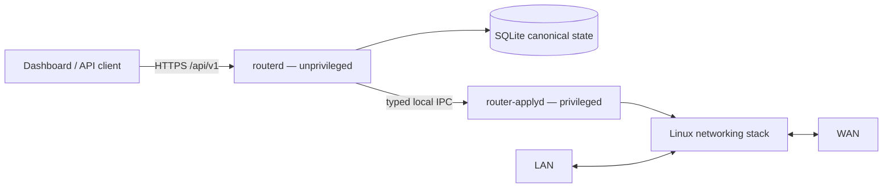

# Architecture

Minimal Router OS keeps the Linux data plane conventional and the management
control plane small. Changes to trust boundaries, privilege separation,
persistence, updates or transaction semantics should be recorded as an ADR.

## Overview



Packet forwarding is not implemented in Go. It remains in the Linux kernel and
standard services such as nftables, pppd, dnsmasq and WireGuard.

Interface ownership is exclusive: `router-applyd` assigns the LAN address, pppd
owns the WAN, and wg(8) owns the tunnels. The installer therefore writes an
`/etc/network/interfaces` that declares every physical interface `manual`, and
`router-applyd` orders itself `after net` so the distribution network service can
never re-run `ifup` against an address the helper has already installed.

## Main components

### `routerd`

Unprivileged management service responsible for:

- HTTPS/API and static dashboard delivery;
- authentication, sessions, CSRF and rate limits;
- typed validation and canonical SQLite state;
- configuration transactions, snapshots and audit events;
- read-only telemetry;
- coordinating the privileged helper.

It must not execute arbitrary commands or directly modify privileged service
configuration.

### `router-applyd`

Root helper with a deliberately narrow local IPC interface. It performs fixed,
allowlisted networking/service operations, records privileged intent/results,
verifies applied state and restores approved snapshots when possible.

Unknown or contradictory privileged state is never reported as success.

### Dashboard

React/TypeScript SPA compiled to static assets and served by `routerd`. It is an
API client only and contains no privileged networking logic.

### Canonical state

SQLite is the source of truth. Generated nftables/dnsmasq/pppd/WireGuard/etc.
files are artifacts derived from validated state. Recovery metadata and
`last-good` state support rollback but do not replace the canonical database.

## Linux integrations

| Function | Component |
|---|---|
| Firewall / NAT | nftables |
| PPPoE | pppd |
| DHCP / DNS / basic filtering | dnsmasq |
| Remote access | WireGuard |
| Dynamic DNS | inadyn |
| QoS | `tc` |
| Optional proxy | Squid |
| Optional Wi-Fi AP | hostapd + Linux bridge |
| Optional per-device accounting | nftables dynamic sets (`acct_rx` / `acct_tx`) |

The project owns only its explicitly named files, interfaces/services and the
`inet minimalrouter` nftables table. It must not flush unrelated host state.

## Configuration transaction

Every mutation follows the same pipeline:

```text
request
  → strict validation
  → deterministic candidate generation
  → component preflight
  → snapshot
  → privileged apply
  → runtime verification
  → commit / confirmation / rollback
```

A transaction ends in exactly one meaningful state:

- `Committed` — candidate is verified and canonical;
- `RolledBack` — previous state is positively verified as restored;
- `RecoveryRequired` — outcome cannot be proven, so further mutation is blocked.

Lockout-prone changes use commit-confirm behavior with automatic rollback before
the candidate becomes canonical. Startup also reconciles canonical state before
normal management is considered ready.

## Security boundaries

Default appliance policy:

- WAN input is deny by default;
- dashboard management is not exposed directly to WAN;
- WireGuard is the intended remote-management path;
- arbitrary WAN port forwarding is outside the current secure profile. Port
  forwards exist, but every generated DNAT rule is bound to the WireGuard server
  interface, so a forward is reachable from the tunnel and never from WAN or
  `ppp0`. Validation refuses a forward when WireGuard is disabled, because such a
  rule could never take effect;
- DNS/DHCP bind only to intended LAN paths;
- unsupported functionality fails closed rather than appearing successful.

Secrets are excluded from normal API responses and logs, stored with restrictive
permissions and encrypted when exported in backups.

See [`SECURITY.md`](SECURITY.md) for the full threat model.

## Updates and recovery

Updates use A/B slots with signed-manifest support and a durable operation
journal. Recovery is available locally even when normal management cannot start.
A stable signed installation/recovery-media workflow remains a release gate.

## Source layout

```text
cmd/                  Go entry points
internal/             control-plane packages
web/                  React dashboard
api/openapi.yaml      REST API contract
migrations/           SQLite migrations
packaging/alpine/     installer + OpenRC integration
scripts/              CI/test helpers
docs/                 guides, evidence and ADRs
```

## Non-goals

The current architecture does not aim for pfSense feature parity, multi-WAN/HA,
IDS/IPS, captive portal, BGP/OSPF, IPsec/OpenVPN, arbitrary shell customization or
container hosting on the router.

Validation details belong in [`docs/TESTING.md`](docs/TESTING.md) and
[`docs/CURRENT_VALIDATION.md`](docs/CURRENT_VALIDATION.md), rather than being
repeated here.
