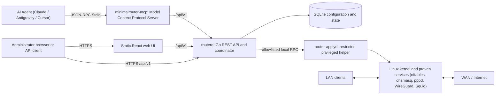
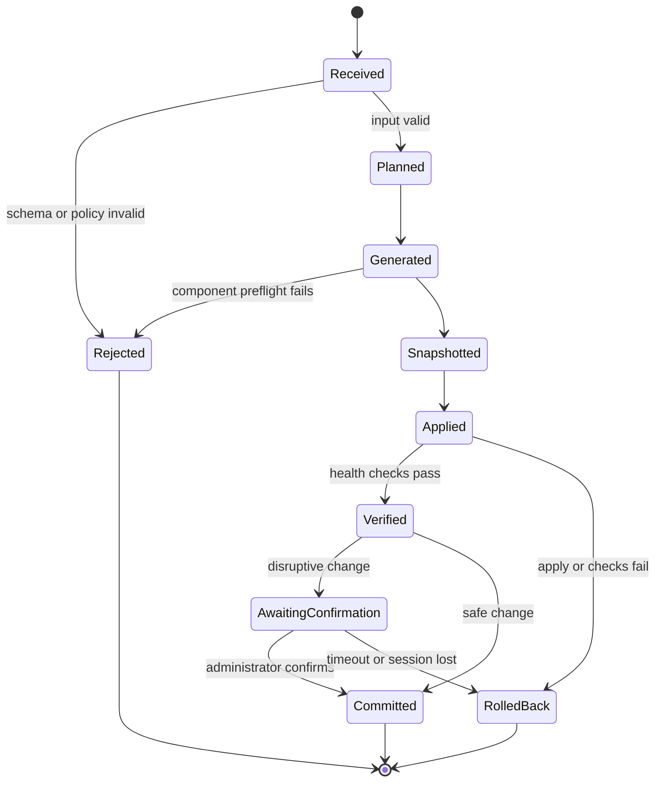

# Architecture

## 1. Purpose

This document defines the initial architecture for Minimal Router OS. It is a
constraint for implementation, not a description of code that already exists.
Changes to the core boundaries or configuration lifecycle require an
Architecture Decision Record (ADR).

## 2. Architectural goals

- Keep Linux in the data plane and the application in the control plane.
- Keep the control plane small, observable, and replaceable.
- Make invalid or dangerous states difficult to express.
- Apply all configuration changes transactionally.
- Avoid direct, ad hoc edits to Linux service configuration.
- Run network-facing code with the least privilege possible.
- Work identically on bare metal and virtualized platforms.

## 3. System context



Packet forwarding never passes through the Go backend or web application.

## 4. Main components

### 4.0 `minimalrouter-mcp` (MCP Server)

- Official Model Context Protocol (MCP) server written in Go.
- Allows AI agents to inspect the appliance through a server-enforced read-only
  session by default.
- Communicates via JSON-RPC 2.0 stdio with strict schema validation.
- Exposes redacted status/configuration tools. Supported mutations require
  explicit local admin mode and still pass normal API authorization,
  validation, snapshot, apply, and rollback boundaries.
- Has no listener. It reaches `routerd` through LAN HTTPS or through the
  authenticated WireGuard tunnel; it is never directly exposed on WAN.

### 4.1 Web UI

- React + TypeScript, built as static assets.
- Served by the Go API process or a minimal local web server.
- Contains no privileged logic and no independent configuration rules.
- Uses only the versioned REST API.
- Uses generated API types when practical to avoid client/server drift.

### 4.2 `routerd`

An unprivileged Go process responsible for:

- HTTPS termination and static UI delivery
- Authentication, sessions, CSRF protection, and authorization
- REST API validation and response formatting
- Reading the canonical configuration
- Planning configuration transactions
- Snapshot metadata and audit events
- Health, status, and low-frequency telemetry
- Coordinating the privileged helper

It must not execute arbitrary shell commands or write service files directly.

### 4.3 `router-applyd`

A small privileged local helper responsible only for allowlisted operations:

- Render candidate files from typed configuration input
- Run component-specific preflight checks
- Atomically install generated files with fixed paths and permissions
- Load nftables rules atomically
- Restart or reload allowlisted services
- Apply network interface and sysctl changes
- Report structured results
- Restore an approved snapshot

Communication uses a root-owned Unix domain socket. Requests are typed,
versioned, size-limited, authenticated by peer credentials, and never contain
free-form commands. The helper rejects unknown operations and paths.

Splitting the privileged helper is a release requirement. A single-process
prototype may be used only before network exposure, and must be tracked as
temporary technical debt.

### 4.4 Canonical store

SQLite is the initial source of truth because it provides local transactions,
schema migrations, integrity constraints, and efficient snapshots without an
external database.

The store contains:

- Desired configuration
- Applied configuration revision
- Snapshot metadata
- Session and rate-limit state
- Audit events
- Non-secret operational state

Generated files for nftables, pppd, dnsmasq, WireGuard, Squid, global DNS
blocklisting, QoS, Cloudflare DDNS, Wi-Fi, and networking are derived
artifacts. They are not edited by hand and are not the source of truth.
Cloudflare Tunnel and DoH placeholders are not activated in the pilot build.

Secrets are stored separately from ordinary settings where practical, with
strict ownership and permissions. Passwords are hashed, not encrypted.

### 4.5 Linux integrations

| Capability | Component | Integration rule |
|---|---|---|
| Packet filtering and NAT | nftables | Generate a complete owned table and load atomically |
| PPPoE | pppd | Generate peer and secret material; validate paths and permissions |
| DHCP and DNS | dnsmasq | Generate isolated configuration; run syntax preflight |
| VPN | WireGuard | Use kernel/userspace tooling through typed operations |
| Wi-Fi AP | hostapd + Linux bridge | Require an AP-capable radio; bridge wired and wireless LAN, preflight hardware, verify service and membership, and commit-confirm or roll back |
| Global DNS blocklist | dnsmasq | Parse bounded HTTPS hosts data or use the built-in list; rules remain global |
| QoS | iproute2 `tc` | Apply a bounded CAKE/fq_codel policy and verify qdisc state |
| Cloudflare DDNS | inadyn | Stable Alpine package; validate configuration, perform a bounded real update, verify OpenRC service, and roll back |
| Cloudflare Tunnel and DoH | none | Disabled; Tunnel would violate the WireGuard-only remote-entry policy and DoH has no verified adapter |
| Updates | Alpine `apk` plus project repository | Automatic route disabled until signed privileged transaction is complete |

The project owns only clearly named configuration files and nftables tables. It
must not flush or replace unrelated host configuration.

## 5. Configuration transaction

Every mutation uses the same state machine:



### 5.1 Detailed sequence

1. Parse a size-limited request into a typed API model.
2. Validate syntax, ranges, cross-field constraints, and policy.
3. Read the current revision and reject stale writes.
4. Build a deterministic execution plan and human-readable diff.
5. Render candidates in a private temporary directory.
6. Run component-specific syntax and semantic preflight checks.
7. Create a checksummed snapshot of desired state and owned artifacts.
8. Apply the candidate using atomic operations where supported.
9. Verify service health, expected interfaces, routes, and connectivity.
10. Commit the new revision or restore the previous known-good snapshot.

LAN address, management binding, firewall input, default route, and other
lockout-prone changes use **commit-confirmed** behavior. The system rolls back
unless the administrator confirms the change within a bounded window from the
new configuration.

### 5.2 Concurrency and idempotency

- Only one apply transaction may run at a time.
- Configuration writes use revision-based optimistic concurrency. General
  idempotency keys remain planned and must not be claimed as implemented.
- Updates use optimistic concurrency with a configuration revision/ETag.
- A client must re-read state after ambiguous transport failure; generic
  replay caching is not implemented yet.
- Process crashes leave enough durable state to resume rollback on boot.

## 6. REST API

- Base path: `/api/v1`
- JSON request and response bodies
- OpenAPI is the contract and is version-controlled
- Cookie-based browser sessions; future non-browser tokens require a separate
  ADR and threat review
- Consistent problem details for errors
- Pagination for collections
- Idempotency keys for mutations
- Revision/ETag checks for configuration writes

Proposed resource groups:

- `/auth`
- `/system`
- `/internet`
- `/interfaces`
- `/lan`
- `/dhcp`
- `/firewall`
- `/wireguard`
- `/cloudflare`
- `/snapshots`
- `/backups`
- `/updates`
- `/transactions`

API handlers never call service commands directly.

## 7. Networking defaults

- WAN input is denied by default.
- Management HTTPS is available from LAN and authenticated WireGuard clients.
- The only permitted new inbound WAN flow is the rate-limited WireGuard UDP
  endpoint. WAN port forwards, WAN HTTPS, SSH, and UPnP are forbidden.
- Forwarding is denied unless explicitly allowed by the generated policy.
- Established and related traffic is handled explicitly.
- Anti-spoofing checks are applied at trust boundaries.
- DNS and DHCP listen only on intended LAN interfaces.
- Unsupported IPv6 is disabled or blocked consistently; it must never bypass
  the IPv4 policy. Full IPv6 support requires feature parity and an ADR.
- SSH is disabled by default.

## 8. Snapshots, backup, and recovery

A snapshot includes:

- Schema version and application version
- Configuration revision
- Canonical non-ephemeral configuration
- Encrypted or explicitly excluded secrets
- Generated artifact hashes
- Compatibility metadata

Snapshots are immutable and checksummed. Retention is bounded by count and disk
budget. Restore always runs migrations, validation, generation, and preflight
before apply.

Exported backups contain credentials and private keys, so plaintext export is
not permitted. The backup encryption format must use a reviewed standard and
library selected in a dedicated ADR.

On boot, an incomplete apply transaction triggers recovery to the last
known-good revision before normal management access becomes available.

## 9. Observability

The appliance records:

- Structured service logs with bounded retention
- Security and configuration audit events
- Apply transaction state and duration
- Boot duration and resource use
- Component health
- Coarse interface traffic counters

Logs must redact passwords, PPPoE credentials, session IDs, CSRF tokens,
WireGuard private keys, Cloudflare tokens, and backup keys.

High-cardinality metrics and long-term graphing are outside version 1.

## 10. Update architecture

- Base-system dependencies come from pinned Alpine stable repositories.
- Project packages and release metadata are signed.
- The appliance verifies signatures and compatibility before installation.
- Updates create a pre-update snapshot.
- Health checks run after reboot.
- A failed update restores the previous known-good application and
  configuration state where the platform supports it.
- The update path never uses `--allow-untrusted`.

The exact A/B or package rollback mechanism requires a dedicated ADR and an
early proof of concept.

## 11. Proposed repository layout

```text
/
├── cmd/
│   ├── routerd/
│   └── router-applyd/
├── internal/
│   ├── api/
│   ├── auth/
│   ├── config/
│   ├── planner/
│   ├── apply/
│   ├── platform/
│   ├── services/
│   ├── snapshots/
│   ├── telemetry/
│   └── updates/
├── api/
│   └── openapi.yaml
├── web/
├── migrations/
├── packaging/
│   └── alpine/
├── installer/
├── tests/
│   ├── integration/
│   └── e2e/
└── docs/
    └── adr/
```

Packages are organized around behavior and trust boundaries, not around UI
pages.

## 12. Platform support

Core behavior must depend only on Linux and documented component interfaces.
Platform detection may enable optional drivers, guest agents, or tuning, but
the configuration model cannot require Proxmox, VMware, Hyper-V, KVM, or
VirtualBox.

Initial reference targets:

- `x86_64` bare metal
- Proxmox VE VM using VirtIO

Additional claimed platforms require installation, upgrade, rollback, and
throughput tests in the release matrix.

## 13. Decisions still required

Before version 1 implementation is considered stable, ADRs must resolve:

- Update rollback strategy
- Backup encryption format and key handling
- Certificate bootstrap and optional trusted-certificate workflow
- Image build and reproducibility process
- IPv6 scope
- Exact hardware/reference performance matrix
- Recovery-console access policy

## 14. Architecture references

- [nftables operations and atomic ruleset loading](https://wiki.nftables.org/wiki-nftables/index.php/Operations_at_ruleset_level)
- [Alpine package management](https://wiki.alpinelinux.org/wiki/Apk)
- [Go Argon2id package documentation](https://pkg.go.dev/golang.org/x/crypto/argon2)
