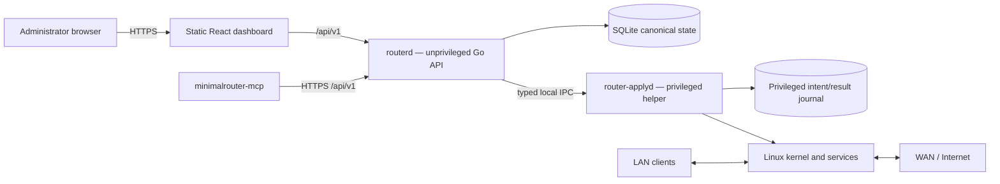
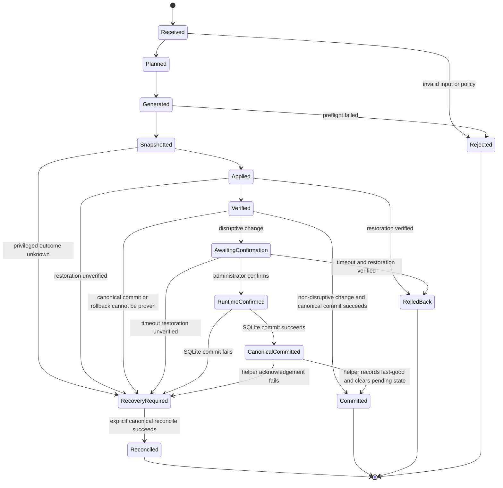

# Architecture

This document describes the current architecture and the invariants that future
changes must preserve. Minimal Router OS is early alpha software; a documented
component may still require additional hardware validation or hardening before a
stable release.

Changes to a trust boundary, privilege model, persistence model, update strategy,
or configuration transaction require an Architecture Decision Record (ADR).

## Goals

- Keep packet forwarding in the Linux kernel.
- Keep the management control plane small and replaceable.
- Make invalid and dangerous states difficult to express.
- Route every configuration change through one validated transaction pipeline.
- Separate network-facing management code from privileged system changes.
- Generate deterministic service configuration instead of editing files ad hoc.
- Support recovery from failed or lockout-prone changes.
- Never report rollback or commit when the runtime outcome cannot be proven.
- Avoid hypervisor-specific requirements in the core configuration model.

## System overview



The Go control plane does not forward user traffic. `nftables`, the kernel
routing stack, WireGuard, pppd, dnsmasq, and other Linux services remain in the
data plane.

## Components

### Dashboard

The dashboard is a React and TypeScript single-page application built with Vite.
It is compiled to static assets and served by `routerd`. Node.js is a development
and build dependency only; it is not installed on the router.

The dashboard:

- contains no privileged logic;
- uses the versioned REST API;
- does not write service configuration directly;
- displays unavailable features honestly rather than simulating success;
- redacts or avoids rendering secret values;
- uses the same typed configuration model as other clients.

### `routerd`

`routerd` is the unprivileged management process. It is responsible for:

- HTTPS termination and static asset delivery;
- authentication, sessions, CSRF, authorization, and rate limiting;
- REST request parsing and validation;
- reading and writing canonical state through the store;
- planning configuration transactions;
- snapshots, audit events, diagnostics, and low-frequency telemetry;
- coordinating `router-applyd` over local IPC;
- blocking new mutations after an ambiguous privileged outcome;
- reconciling the SQLite canonical configuration before exposing normal
  management after startup.

`routerd` must not:

- execute arbitrary commands;
- accept shell fragments;
- write privileged service files;
- load caller-supplied nftables programs;
- restart arbitrary services;
- bind a management listener to WAN.

### `router-applyd`

`router-applyd` is a local privileged helper. It currently runs as root because
it configures interfaces, firewall rules, sysctls, routes, and system services.

Its interface is intentionally narrow:

- local Unix socket only;
- protected socket ownership and permissions;
- Linux peer-credential verification;
- versioned, size-limited request schema;
- serialized and time-bounded operations;
- fixed binaries, arguments, paths, and service allowlists;
- deterministic candidate generation;
- component-specific preflight;
- atomic file replacement where supported;
- structured redacted results;
- rollback to an approved snapshot;
- a durable intent record written before privileged side effects;
- a durable completed-result record for idempotent response replay;
- structural validation of transaction, last-good, and pending-confirmation
  metadata;
- fail-closed handling of unreadable, corrupt, or incomplete privileged state.

A duplicate request with the same transaction ID and identical content returns
the recorded result instead of repeating side effects. An incomplete intent after
a process or power interruption is not replayed as a fresh operation: it yields
`RecoveryRequired` until canonical reconciliation succeeds.

Further Linux capability, namespace, and syscall confinement remains release
hardening work.

### Canonical store

SQLite is the source of truth for desired and applied state. Generated service
files are disposable artifacts. The privileged helper's `last-good` file is a
recovery aid and must not advance ahead of the canonical SQLite commit.

The store contains:

- versioned configuration;
- applied revisions;
- snapshot metadata and configuration payloads;
- administrator password hash and optional TOTP secret;
- server-side sessions and rate-limit state;
- bounded audit events;
- non-secret operational metadata.

Runtime databases, configuration exports, journals, and snapshots must never be
committed to the source repository.

### MCP bridge

`minimalrouter-mcp` is a local Model Context Protocol bridge written in Go. Its
default mode is read-only. Administrator mode must be explicitly enabled and is
not considered safe for unattended browsing or untrusted content.

The MCP bridge:

- has no WAN listener;
- communicates with `routerd` through the normal HTTPS API;
- receives redacted responses;
- cannot bypass API authorization, validation, snapshots, or rollback;
- treats AI-generated output as untrusted input.

## Linux integrations

| Capability | Component | Current integration rule |
|---|---|---|
| Firewall and NAT | nftables | Generate one project-owned table and load it atomically |
| PPPoE | pppd | Generate the WAN peer and secret file with fixed paths and permissions |
| DHCP and DNS | dnsmasq | Bind to the selected LAN interface and preflight syntax |
| Global DNS blocklist | dnsmasq | Generate a bounded global sinkhole list; not a full AdGuard Home replacement |
| VPN | WireGuard | Generate server config and unique peer `/32` routes; phone profiles default to split tunnel |
| QoS | `tc` | Apply a bounded CAKE or fq_codel configuration and verify qdisc state |
| Forward proxy | Squid | Optional non-caching proxy with a restricted configuration surface |
| Cloudflare DDNS | inadyn | Optional and disabled by default; validate config and service lifecycle |
| Wi-Fi access point | hostapd and Linux bridge | Optional, hardware-dependent, disabled by default, commit-confirmed |
| Cloudflare Tunnel | none | Not enabled in the secure profile |
| Automatic updates | A/B bootstrap path | Signed staging, explicit activation, durable journal, and rollback; target-host qualification still required |

The project owns only explicitly named files, service instances, interfaces, and
the `inet minimalrouter` nftables table. It must not flush unrelated host state.

## Configuration transaction

Every mutation uses the same state machine:



Detailed flow:

1. Parse a size-limited request into a strict typed model.
2. Reject unknown or invalid security-sensitive fields.
3. Validate syntax, ranges, network overlap, interface names, and cross-field
   policy.
4. Compare the expected revision with current canonical state.
5. Build a deterministic plan and candidate artifacts.
6. Run component-specific syntax and semantic preflight.
7. Create a checksummed snapshot.
8. Write a durable privileged-operation intent before any side effect.
9. Apply through the privileged helper.
10. Verify service, interface, route, firewall, and connectivity expectations.
11. Persist the privileged result so a lost IPC response can be replayed without
    repeating side effects.
12. For non-disruptive changes, commit SQLite only after verified apply; restore
    the old configuration if that commit fails.
13. For disruptive changes, verify runtime confirmation first, commit SQLite
    second, then ask the helper to record the same configuration as `last-good`
    and clear pending state.
14. End as `Committed`, verified `RolledBack`, or blocking
    `RecoveryRequired`. Unknown state is never converted into success.

Only one apply transaction may run at a time. Repeated or concurrent mutations
must not produce partially mixed configurations. `RecoveryRequired` blocks new
configuration until an explicit `RECONCILE` operation re-applies and verifies the
SQLite canonical configuration.

## Lockout-prone changes

Changes to LAN address, management access, firewall input, interface roles,
Wi-Fi bridging, or WireGuard parameters that carry a WireGuard-only management
path use commit-confirmed behavior.

During a candidate LAN address transition, the implementation may provision old
and new management addresses temporarily. Confirmation is intentionally
three-part:

1. `CONFIRM` finalizes and verifies candidate runtime reachability while the old
   canonical configuration remains available for rollback.
2. `routerd` commits the exact candidate revision to SQLite.
3. `COMMIT_CONFIRMED` verifies that runtime still matches, records the candidate
   as helper `last-good`, and removes pending-confirmation state.

Transport retries within one phase reuse the same transaction ID. A later,
explicit retry of the final helper commit uses a fresh ID so a transient storage
failure is not permanently replayed from the idempotency cache.

If timeout occurs before SQLite commit, the previous configuration is restored.
After SQLite commit, timeout rollback is disabled because the candidate is now
canonical; any missing helper acknowledgement is reported as
`RecoveryRequired` and resolved by canonical reconciliation.

## Startup and reconciliation

On startup, `routerd` loads and validates the SQLite canonical configuration and
asks `router-applyd` to reconcile the active runtime before normal management is
considered ready. `RECONCILE` is the only operation allowed to supersede an
incomplete or `RecoveryRequired` privileged journal record, and it may apply only
the canonical configuration generated by `routerd`.

If canonical state cannot be read, generated, applied, or verified, startup must
fail closed rather than initialize a new default router over damaged state or
claim that networking is healthy.

## Network policy

The secure appliance profile follows these defaults:

- WAN input is default deny.
- Web management is unavailable from WAN.
- WireGuard is the only accepted new WAN service when enabled.
- WAN port forwarding is rejected in the current profile.
- LAN-to-WAN forwarding is explicitly generated.
- DNS and DHCP listen only on selected LAN paths.
- invalid traffic is dropped before service-specific accepts;
- established and related traffic is explicit;
- anti-spoofing is applied at trust boundaries;
- unsupported IPv6 is disabled and blocked rather than allowed around IPv4
  policy.

## Authentication and browser boundary

The management plane uses server-side sessions, secure cookies, CSRF protection,
same-origin checks, host and local-destination validation, bounded request sizes,
and strict security headers.

The first-run wizard creates the administrator password. There is no shipped
default password and no insecure remote recovery endpoint.

## Secrets

Secrets include PPPoE credentials, administrator hashes, sessions, TOTP secrets,
WireGuard keys, provider tokens, Wi-Fi credentials, Squid credentials, and
backup passwords.

They must be:

- absent from source control and fixtures;
- omitted or redacted from normal API responses;
- excluded from request and audit logs;
- written with restrictive ownership and permissions;
- encrypted when included in exported backups;
- rotated after accidental disclosure.

WireGuard client private keys are generated for one-time delivery and should not
be persisted as ordinary configuration state.

## Installation and boot

The current supported development path is a clean Alpine Linux 3.22 system with
two network interfaces.

The distribution installer:

- validates architecture and expected payload files;
- installs pinned platform dependencies;
- creates dedicated users and restrictive directories;
- installs OpenRC services;
- installs and immediately applies hardened sysctls;
- loads required kernel modules immediately and at boot;
- disables common unnecessary remote services;
- enables `router-applyd` before `routerd`;
- requires canonical runtime reconciliation before management readiness.

A signed bootable ISO and signed recovery-media workflow remain release gates.

## Observability

The project records bounded operational and audit information such as:

- authentication results;
- configuration transaction state;
- snapshot and restore events;
- service lifecycle results;
- coarse system and interface status;
- redacted security events.

Logs must not contain request bodies, credentials, private keys, session IDs,
CSRF tokens, QR payloads, or unredacted generated configurations.

## Source layout

```text
cmd/                    Go entry points
  routerd/
  router-applyd/
  minimalrouter-mcp/
internal/               Private Go packages
  api/
  apply/
  auth/
  config/
  firmware/
  services/
  telemetry/
  tlsutil/
web/                    React/Vite dashboard
api/openapi.yaml        Versioned API contract
migrations/             SQLite migrations
packaging/alpine/       Alpine installer and OpenRC files
scripts/                 CI and test helpers
docs/                   Guides, evidence, and ADRs
.github/                 CI and community configuration
```

## Architectural non-goals for the current release line

The current design does not attempt to provide pfSense feature parity, a general
package platform, arbitrary shell customization, containers on the router,
IDS/IPS, captive portal, BGP, OSPF, IPsec, OpenVPN, multi-WAN, or high
availability.

Adding one of these features requires a product decision and threat review, not
only an implementation pull request.

## Validation

Architecture claims must be backed by tests or recorded evidence. The current CI
covers Go tests with the race detector, vet, vulnerability scanning, dashboard
lint/unit/build/E2E, clean Alpine installation and update rollback, crash and
journal recovery, ARM64 execution, namespace networking, static security
analysis, and control-plane benchmarks.

Automated tests cover the transaction protocol and simulated interruption
boundaries, but they do not replace target-host full-disk, read-only filesystem,
process-kill, abrupt power-loss, real PPPoE, external WireGuard, physical NIC,
backup-restore, sustained-load, signed-media, or independent security testing.