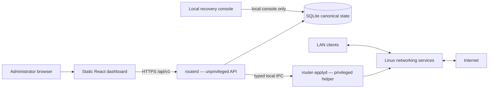

# Minimal Router OS

<p align="center">
  
</p>

<p align="center">
  <a href="#project-status"></a>
  <a href="https://github.com/vladimirperovic/minimalrouter/actions/workflows/ci.yml"></a>
  <a href="https://github.com/vladimirperovic/minimalrouter/actions/workflows/codeql.yml"></a>
  <a href="LICENSE"></a>
</p>

<p align="center">
  <a href="docs/INSTALLATION.md">Installation</a> ·
  <a href="docs/PROXMOX.md">Proxmox</a> ·
  <a href="docs/CURRENT_VALIDATION.md">Current validation</a> ·
  <a href="docs/README.md">Documentation</a> ·
  <a href="SECURITY.md">Security</a> ·
  <a href="ROADMAP.md">Roadmap</a>
</p>

<a id="project-status"></a>

> **Development status: early alpha.** Minimal Router OS is a research and
> homelab project. It has completed an initial owner-Proxmox Internet/performance
> pilot with successful pfSense fallback, but remains suitable only for a
> console-accessible controlled pilot with a known-good router ready for
> rollback. It is not yet a drop-in unattended replacement for pfSense, OpenWrt,
> or a commercially supported firewall.

Minimal Router OS is a focused Alpine Linux router appliance with a Go control
plane and a static React dashboard. Packet forwarding remains in the Linux
kernel. The project uses proven components instead of implementing a new packet
processing stack:

- `nftables` for firewalling and NAT;
- `pppd` for PPPoE;
- `dnsmasq` for DHCP, DNS, filtering, and bounded service sets;
- WireGuard for remote access;
- optional Squid, QoS, Cloudflare DDNS, and Wi-Fi AP support.

## Current baseline

Implemented and covered in the development environment:

- unprivileged `routerd` plus narrow privileged `router-applyd`;
- SQLite canonical configuration state and migrations;
- typed validation and deterministic configuration generation;
- snapshot, preflight, apply, verification, commit-confirm, and rollback;
- default-deny WAN policy and LAN-to-WAN NAT;
- PPPoE, DHCP, DNS, WireGuard, DNS Filter profiles, QoS, Cloudflare DDNS, and Wi-Fi paths;
- Argon2id authentication, secure sessions, CSRF, rate limiting, and optional TOTP;
- encrypted backup export, configuration snapshots, and local recovery console;
- crash-safe A/B update activation and rollback using a durable operation journal;
- signed manifests, SHA-256 verification, checksums, SPDX SBOMs, and provenance;
- bounded local storage with 80% warning / 90% critical pressure, HTTP 507
  fail-closed durable writes, bounded gateway/audit/snapshot history, passive WAL
  maintenance, and rotated router service logs;
- one authenticated central appliance-health model covering recovery, storage,
  memory, conntrack, time, WAN/gateway, supervised services, DNS/DHCP, PPPoE,
  WireGuard, update state, and encrypted-backup age;
- frontend unit tests and Playwright browser E2E tests;
- clean Alpine install, first-run wizard, signed update, activation, and rollback CI;
- race tests, `vet`, `govulncheck`, CodeQL, secret scan, `gosec`, `shellcheck`, and
  `actionlint`;
- API/update benchmarks, fuzzing, ARM64 QEMU smoke tests, and an isolated
  WAN-router-LAN namespace laboratory.

The 2026-08-01 owner-Proxmox pilot additionally demonstrated real Internet
forwarding, 570/327 Mbps in the recorded download/upload sample, zero loss in a
600-packet test, 200/200 DNS queries, dashboard responsiveness under the recorded
CPU stress test, 172 MB observed post-test RAM use, and successful operational
fallback to pfSense in approximately 93 seconds. WireGuard did not complete a
phone handshake and Cloudflare DDNS was not yet confirmed, so both remain open
target-host validation items.

The current dashboard build uses TypeScript 6.0.3 and Node.js type definitions
26.1.2. Node.js is a build-time dependency only; it is not installed or running
on the router.

See [`docs/CURRENT_VALIDATION.md`](docs/CURRENT_VALIDATION.md) for the exact dated
automated evidence, target-host evidence, benchmark ranges, and remaining manual
gates. The complete pilot record is
[`docs/PROXMOX_TEST_REPORT_2026-08-01.md`](docs/PROXMOX_TEST_REPORT_2026-08-01.md).

## What remains unproven

The first target-host pilot closed part of the earlier Proxmox uncertainty, but
production readiness still requires recorded evidence for:

- stable WAN/LAN identity across repeated Proxmox and guest reboots;
- repeated real ISP PPPoE disconnect/reconnect and reboot recovery;
- sustained/repeated physical or VirtIO NIC packet rate, CPU, IRQ, jitter, and
  thermal behavior beyond the first throughput sample;
- a successful real WireGuard handshake, traffic test, throughput, and recovery
  from an unrelated external network;
- a successful Cloudflare DDNS update and later public-IP-change propagation;
- external IPv4/IPv6 scanning;
- backup restore into a fresh VM;
- destructive full-disk, inode-exhaustion, read-only-filesystem, service-crash,
  and power-loss fault injection on a disposable target;
- at least seven days of sustained operation;
- owner-signed install/recovery media and independent security review.

## Architecture



Every configuration mutation follows the same invariant:

```text
input → validation → typed model → generation → preflight → snapshot
      → apply → verification → commit or rollback
```

Unsupported functionality fails closed or is shown as unavailable rather than
being simulated.

## Controlled installation

There is no signed stable ISO yet. Use a clean Alpine Linux 3.22 VM or dedicated
test system with two interfaces and local console access.

Start with:

- [`docs/INSTALLATION.md`](docs/INSTALLATION.md)
- [`docs/PROXMOX.md`](docs/PROXMOX.md)
- [`docs/PROXMOX_TEST_REPORT_2026-08-01.md`](docs/PROXMOX_TEST_REPORT_2026-08-01.md)
- [`docs/CLOUDFLARE_DDNS.md`](docs/CLOUDFLARE_DDNS.md)
- [`docs/RECOVERY.md`](docs/RECOVERY.md)
- [`docs/TESTING.md`](docs/TESTING.md)
- [`docs/STORAGE_PRESSURE.md`](docs/STORAGE_PRESSURE.md)
- [`docs/APPLIANCE_HEALTH.md`](docs/APPLIANCE_HEALTH.md)

Keep the existing router available. Initial testing must use an isolated LAN and
a test/NAT WAN path. Never run two DHCP servers on the same production LAN.

Build an AMD64 development archive:

```sh
git clone https://github.com/vladimirperovic/minimalrouter.git
cd minimalrouter
pnpm --dir web install --frozen-lockfile
make dist-amd64
cd build
sha256sum -c minimalrouter-linux-amd64.tar.gz.sha256
```

A development archive is not a signed stable firmware release.

## Development

Requirements:

- the Go version declared in `go.mod`;
- Node.js 22;
- pnpm.

```sh
go test -race ./...
go vet ./...

pnpm --dir web install --frozen-lockfile
pnpm --dir web lint
pnpm --dir web test
pnpm --dir web build
pnpm --dir web exec playwright install chromium
pnpm --dir web test:e2e
```

Additional automated suites are defined in:

- `.github/workflows/ci.yml`;
- `.github/workflows/deep-validation.yml`;
- `.github/workflows/performance.yml`;
- `.github/workflows/codeql.yml`.

## Security and privacy

A router is a security boundary. Read [`SECURITY.md`](SECURITY.md) before running
or changing privileged code. Do not report vulnerabilities in public issues.

Never commit or publicly attach:

- PPPoE credentials;
- administrator passwords, hashes, sessions, or CSRF values;
- WireGuard private keys, preshared keys, profiles, or QR codes;
- provider tokens;
- signing private keys;
- backups, databases, snapshots, packet captures, or runtime logs;
- real public addresses, hostnames, MAC addresses, or device inventory.

The project does not intentionally include project-operated analytics,
advertising, or cloud telemetry. See [`PRIVACY.md`](PRIVACY.md).

## Documentation

The complete index is [`docs/README.md`](docs/README.md). Key documents:

- [`ARCHITECTURE.md`](ARCHITECTURE.md)
- [`PROJECT.md`](PROJECT.md)
- [`SECURITY.md`](SECURITY.md)
- [`docs/CURRENT_VALIDATION.md`](docs/CURRENT_VALIDATION.md)
- [`docs/INSTALLATION.md`](docs/INSTALLATION.md)
- [`docs/PROXMOX.md`](docs/PROXMOX.md)
- [`docs/PROXMOX_TEST_REPORT_2026-08-01.md`](docs/PROXMOX_TEST_REPORT_2026-08-01.md)
- [`docs/CLOUDFLARE_DDNS.md`](docs/CLOUDFLARE_DDNS.md)
- [`docs/TESTING.md`](docs/TESTING.md)
- [`docs/RECOVERY.md`](docs/RECOVERY.md)
- [`docs/STORAGE_PRESSURE.md`](docs/STORAGE_PRESSURE.md)
- [`docs/APPLIANCE_HEALTH.md`](docs/APPLIANCE_HEALTH.md)
- [`docs/RESOURCE_AND_HARDWARE_TEST.md`](docs/RESOURCE_AND_HARDWARE_TEST.md)
- [`docs/SECURITY_REVIEW.md`](docs/SECURITY_REVIEW.md)
- [`ROADMAP.md`](ROADMAP.md)
- [`CHANGELOG.md`](CHANGELOG.md)

## Releases

There is no stable signed release yet. Official releases must follow
[`docs/RELEASE_PROCESS.md`](docs/RELEASE_PROCESS.md) and
[`docs/RELEASE_SECURITY.md`](docs/RELEASE_SECURITY.md), publish signed manifests,
checksums, SPDX SBOMs, provenance, known limitations, and the exact supported
deployment class.

## License

Minimal Router OS is available under the [MIT License](LICENSE).

The project name and documentation do not imply endorsement by Netgate, pfSense,
OpenWrt, AdGuard, Cloudflare, Alpine Linux, or any other referenced project or
company.
