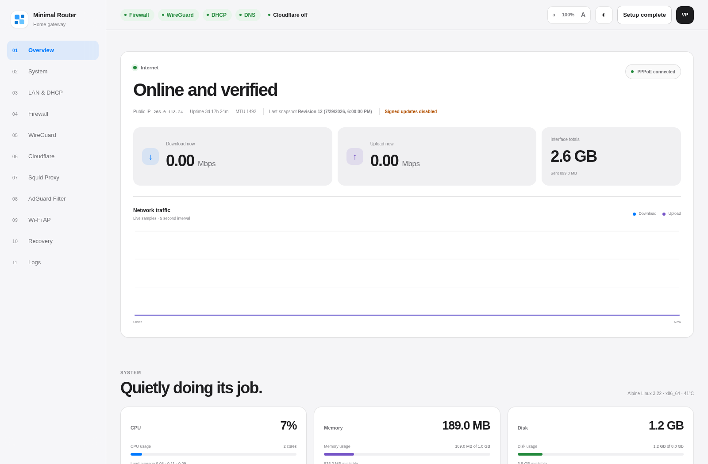
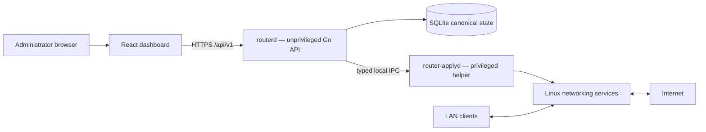

# Minimal Router OS

[](#project-status)
[](https://github.com/vladimirperovic/minimalrouter/actions/workflows/ci.yml)
[](https://github.com/vladimirperovic/minimalrouter/actions/workflows/codeql.yml)
[](LICENSE)

<a id="project-status"></a>

> **Development status: early alpha.** Minimal Router OS is a community-driven
> research and homelab project. It is not yet a drop-in replacement for pfSense,
> OpenWrt, or a commercially supported firewall. Use it on an isolated test
> network until the project publishes a stable release and a completed hardware
> validation matrix.

Minimal Router OS is a small Alpine Linux router appliance with a Go control
plane and a React dashboard. It uses proven Linux networking components instead
of implementing a new packet-processing stack:

- `nftables` for firewalling and NAT
- `pppd` for PPPoE
- `dnsmasq` for DHCP, DNS, and the integrated global DNS blocklist
- WireGuard for remote access
- optional Squid proxy, QoS, Cloudflare DDNS, and Wi-Fi AP support

The goal is a focused home and small-office router that is understandable,
resource-efficient, secure by default, and pleasant to administer.

## Everyone is welcome

This project was started as a practical homelab development project, not by a
large networking vendor. It will improve through testing, review, documentation,
design feedback, and contributions from the community.

You do not need to be an expert systems programmer to participate. Beginners,
homelab users, network engineers, security reviewers, designers, technical
writers, testers, and experienced Go or React developers are all welcome.
Small fixes, reproducible bug reports, documentation improvements, translations,
accessibility work, and hardware test results are valuable contributions.

Read [CONTRIBUTING.md](CONTRIBUTING.md) before submitting a change.

## Dashboard

The dashboard follows a restrained Apple × Swiss visual system and exposes the
router configuration through the same validated API used by other clients.



The image above was captured automatically from the current React production
build. Every displayed address, hostname, device, MAC address, status value, and
measurement is synthetic documentation data. It is not a screenshot of a
personal or production network.

## Current capabilities

### Implemented and tested in the development environment

- Split control plane: unprivileged `routerd` and privileged `router-applyd`
- SQLite canonical configuration store
- transactional generation, preflight, snapshot, apply, verify, and rollback
- default-deny WAN firewall and NAT
- PPPoE WAN configuration
- DHCP and DNS service
- global DNS blocklist/sinkhole integrated into the router UI
- WireGuard server and split-tunnel phone profiles
- encrypted backup export and configuration snapshots
- Argon2id authentication, secure sessions, CSRF protection, and optional TOTP
- live DHCP lease display and redacted audit logs
- guided first-run wizard
- Alpine/OpenRC packaging and a clean-install CI smoke test

### Optional and disabled by default

- Cloudflare Dynamic DNS
- Wi-Fi access point
- Squid forward proxy
- traffic shaping/QoS
- WireGuard remote access

### Not yet a stable release feature

- production-grade IPv6 parity
- multi-WAN and high availability
- VLAN and managed-switch workflows
- signed recovery images and a complete update rollback channel
- a broad third-party package ecosystem
- unattended production support

Unsupported functionality fails closed or is shown as unavailable rather than
being simulated.

## Minimal Router OS and pfSense

This is an approximate comparison of project scope, not a claim of feature or
security parity.

| Area | Minimal Router OS — current alpha | pfSense |
|---|---|---|
| Maturity | Experimental, community development project | Mature production firewall platform |
| Intended use today | Lab, homelab pilot, controlled testing | Production home, business, and enterprise deployments |
| Base operating system | Alpine Linux | FreeBSD |
| Hardware architecture | Development targets include x86-64 and ARM64 | x86-64 plus supported Netgate ARM appliances |
| RAM | About 140 MiB idle and about 203 MiB after setup/config activity in one ARM64 VM test; 512 MiB tested minimum, 1 GiB recommended for comfortable development use | Official minimum is 1 GiB; actual sizing depends on states, packages, VPN, and traffic |
| Disk | Small application payload; 8 GiB is currently recommended for the appliance, logs, snapshots, and upgrades | Official minimum is 8 GB |
| CPU | Narrow service set is expected to have low idle CPU use, but a fair cross-platform benchmark has not yet been published | Depends heavily on throughput, VPN, IDS/IPS, packages, and state count |
| Firewall/NAT | Focused generated `nftables` policy; WAN port forwards intentionally unsupported in the secure profile | Extensive firewall, NAT, policy routing, aliases, schedules, and advanced features |
| Remote administration | WireGuard-first; no WAN web management | Multiple mature VPN and administration options |
| DNS ad/domain blocking | Basic global DNS blocklist is built directly into the Minimal Router configuration and dashboard | DNS blocking is commonly added with the optional `pfBlockerNG` package or a separate DNS filtering service |
| Packages | No general package ecosystem | Large optional package system |
| IPv6 | Disabled/fail-closed until policy parity is complete | Mature IPv6 support |
| High availability | Not implemented | CARP and established HA workflows |
| Support | Community best effort | Community plus commercial Netgate support options |

The lower measured memory footprint is mainly a consequence of Minimal Router
OS having a much narrower feature set. pfSense remains substantially more mature,
more flexible, more thoroughly deployed, and the safer choice when its advanced
features or production support are required.

References:

- pfSense minimum requirements: https://docs.netgate.com/pfsense/en/latest/hardware/minimum-requirements.html
- pfSense hardware sizing: https://docs.netgate.com/pfsense/en/latest/hardware/size.html
- pfSense package system and pfBlockerNG: https://docs.netgate.com/pfsense/en/latest/packages/

A more detailed three-way comparison is available in
[docs/COMPARISON.md](docs/COMPARISON.md).

## Architecture



Packet forwarding stays in the Linux kernel. API handlers do not execute
arbitrary shell commands or edit service configuration directly.

Every configuration change follows the same invariant:

```text
input → validation → typed model → generation → preflight → snapshot
      → apply → verification → commit or rollback
```

See [ARCHITECTURE.md](ARCHITECTURE.md) and [SECURITY.md](SECURITY.md).

## Development setup

Requirements:

- Go version declared in `go.mod`
- Node.js 22
- pnpm

```sh
git clone https://github.com/vladimirperovic/minimalrouter.git
cd minimalrouter

go test -race ./...
go vet ./...

pnpm --dir web install --frozen-lockfile
pnpm --dir web lint
pnpm --dir web build
```

Run the dashboard development server:

```sh
pnpm --dir web dev
```

The production router does not require Node.js. The dashboard is compiled to
static assets during the build.

## Alpine test installation

There is no signed stable ISO yet. For a controlled lab installation, use a
clean Alpine Linux 3.22 VM with two network interfaces and follow
[docs/PROXMOX.md](docs/PROXMOX.md).

Build a self-contained x86-64 archive:

```sh
make dist-amd64
```

The CI workflow also installs the generated archive in a clean privileged Alpine
container and completes the first-run wizard over HTTPS.

## Security

A router is a security boundary. Please read [SECURITY.md](SECURITY.md) before
running the project or changing privileged code.

Do not report vulnerabilities in a public issue. Follow the private reporting
instructions in the security policy.

Never commit:

- PPPoE usernames or passwords
- administrator passwords or hashes
- WireGuard private or preshared keys
- Cloudflare tokens
- exported backups
- real runtime databases, configuration files, or snapshots

## Documentation

- [Architecture](ARCHITECTURE.md)
- [Security policy and threat model](SECURITY.md)
- [Contributing](CONTRIBUTING.md)
- [Development guide](docs/DEVELOPMENT.md)
- [Testing guide](docs/TESTING.md)
- [Proxmox lab guide](docs/PROXMOX.md)
- [Current security review](docs/SECURITY_REVIEW.md)
- [Detailed platform comparison](docs/COMPARISON.md)
- [Roadmap](ROADMAP.md)
- [Architecture decisions](docs/adr/README.md)

## License

Minimal Router OS is available under the [MIT License](LICENSE).

The project name and documentation do not imply endorsement by Netgate, pfSense,
AdGuard, Cloudflare, or any other referenced project or company.
