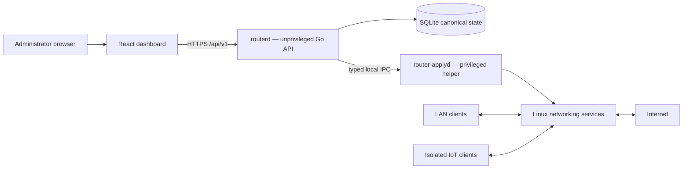

# Minimal Router OS

<p align="center">
  
</p>

<p align="center">
  <a href="#project-status"></a>
  <a href="https://github.com/vladimirperovic/minimalrouter/actions/workflows/ci.yml"></a>
  <a href="https://github.com/vladimirperovic/minimalrouter/actions/workflows/codeql.yml"></a>
  <a href="LICENSE"></a>
</p>

<p align="center">
  <a href="docs/INSTALLATION.md">Installation</a> ·
  <a href="docs/README.md">Documentation</a> ·
  <a href="SECURITY.md">Security</a> ·
  <a href="CONTRIBUTING.md">Contributing</a> ·
  <a href="ROADMAP.md">Roadmap</a>
</p>

<a id="project-status"></a>

> **Development status: early alpha.** Minimal Router OS is a community-driven
> research and homelab project. It is not yet a drop-in replacement for pfSense,
> OpenWrt, or a commercially supported firewall. Use it on an isolated test
> network until the project publishes a stable release and a completed hardware
> validation matrix.

Minimal Router OS is a small Alpine Linux router appliance with a Go control
plane and a React dashboard. It combines proven Linux networking components with
a narrow, validated configuration system instead of implementing a new packet
processing stack.

- `nftables` for firewalling and NAT
- `pppd` for PPPoE
- `dnsmasq` for DHCP, DNS, the integrated global DNS blocklist, and service-address sets
- WireGuard for remote access
- optional Squid proxy, QoS, Cloudflare DDNS, Wi-Fi AP, isolated IoT zone, and device schedules

The goal is a focused home and small-office router that is understandable,
resource-efficient, secure by default, recoverable after mistakes, and pleasant
to administer.

## Dashboard

The dashboard follows a restrained Apple × Swiss visual system and exposes the
router configuration through the same validated API used by other clients.


The image above was captured automatically from the current React production
build. Every displayed address, hostname, device, MAC address, status value, and
measurement is synthetic documentation data. It is not a screenshot of a
personal or production network.

## Current capabilities

### Implemented and tested in the development environment

- split control plane: unprivileged `routerd` and privileged `router-applyd`;
- SQLite canonical configuration store;
- transactional generation, preflight, snapshot, apply, verify, and rollback;
- default-deny WAN firewall and NAT;
- PPPoE WAN configuration;
- DHCP and DNS service;
- global DNS blocklist/sinkhole integrated into the router UI;
- WireGuard server and split-tunnel phone profiles;
- encrypted backup export and configuration snapshots;
- Argon2id authentication, secure sessions, CSRF protection, and optional TOTP;
- live DHCP lease display and redacted audit logs;
- guided first-run wizard with operator-facing NIC inventory and timezone selection;
- optional routed IoT zone on a dedicated interface or one explicitly configured
  802.1Q VLAN;
- fixed-reservation device schedules enforced in `nftables`, including an evening
  YouTube/Steam template;
- Alpine/OpenRC packaging and a clean-install CI smoke test.

### Optional and disabled by default

- Cloudflare Dynamic DNS;
- Wi-Fi access point;
- Squid forward proxy;
- traffic shaping/QoS;
- WireGuard remote access;
- IoT isolation and device schedules.

### Not yet a stable release feature

- production-grade IPv6 parity;
- multi-WAN and high availability;
- general-purpose VLAN, managed-switch, and multi-zone automation beyond the single IoT zone;
- signed recovery images and a complete update rollback channel;
- a broad third-party package ecosystem;
- unattended production support.

Unsupported functionality fails closed or is shown as unavailable rather than
being simulated.

## IoT isolation and device schedules

The optional IoT zone is a separate routed IPv4 network. It can use either a
dedicated physical NIC or one explicitly configured 802.1Q VLAN. Generated
firewall policy permits IoT clients to use DHCP, DNS, ICMP, and the Internet,
while blocking forwarding between the IoT zone and the main LAN in both
directions. The management dashboard is not exposed on the IoT interface.

Device schedules require a fixed DHCP reservation and are evaluated in the
appliance timezone. A built-in household template can block a child device on
weekdays until 19:00, permit only YouTube and Steam until 23:59, and permit the
same services all day on Saturday and Sunday. The rules are enforced in
`nftables`, not only hidden in the dashboard.

Service-only access is best-effort DNS/IP classification. It is not HTTPS
content inspection: providers can change domains, share CDN addresses, or use
previously cached addresses. IoT client-to-client traffic on the same Layer-2
segment also does not cross the router; wireless client isolation or switch-port
isolation remains the responsibility of the access point or switch.

## Project principles

- **Safe defaults:** WAN is default-deny and management is not exposed directly
  to WAN.
- **Least privilege:** the network-facing API runs separately from the privileged
  apply helper.
- **Deterministic changes:** configuration is validated and generated from typed
  models rather than arbitrary shell fragments.
- **Recoverability:** disruptive changes use snapshots, verification,
  confirmation, and rollback.
- **Honest status:** documentation distinguishes implemented behavior, measured
  evidence, planned work, and unsupported features.
- **Small scope:** features may be declined when they significantly expand attack
  surface or long-term maintenance cost.

## Minimal Router OS and pfSense

This is an approximate comparison of project scope, not a claim of feature or
security parity.

| Area | Minimal Router OS — current alpha | pfSense |
|---|---|---|
| Maturity | Experimental, community development project | Mature production firewall platform |
| Intended use today | Lab, homelab pilot, controlled testing | Production home, business, and enterprise deployments |
| Base operating system | Alpine Linux | FreeBSD |
| Hardware architecture | Development targets include x86-64 and ARM64 | x86-64 plus supported Netgate ARM appliances |
| RAM | About 140 MiB idle and about 203 MiB after setup/config activity in one ARM64 VM test; 512 MiB tested minimum, 1 GiB recommended for comfortable development use | Official minimum is 1 GiB; actual sizing depends on states, packages, VPN, and traffic |
| Disk | Small application payload; 8 GiB is currently recommended for the appliance, logs, snapshots, and upgrades | Official minimum is 8 GB |
| CPU | Narrow service set is expected to have low idle CPU use, but a fair cross-platform benchmark has not yet been published | Depends heavily on throughput, VPN, IDS/IPS, packages, and state count |
| Firewall/NAT | Focused generated `nftables` policy; WAN port forwards intentionally unsupported in the secure profile | Extensive firewall, NAT, policy routing, aliases, schedules, and advanced features |
| Remote administration | WireGuard-first; no WAN web management | Multiple mature VPN and administration options |
| DNS ad/domain blocking | Basic global DNS blocklist is built directly into the Minimal Router configuration and dashboard | DNS blocking is commonly added with the optional `pfBlockerNG` package or a separate DNS filtering service |
| IoT and schedules | One optional isolated IPv4 zone plus fixed-device time windows and small DNS/IP service groups | Mature VLAN, alias, schedule, captive-portal, and package-based policy options |
| Packages | No general package ecosystem | Large optional package system |
| IPv6 | Disabled/fail-closed until policy parity is complete | Mature IPv6 support |
| High availability | Not implemented | CARP and established HA workflows |
| Support | Community best effort | Community plus commercial Netgate support options |

The lower measured memory footprint is mainly a consequence of Minimal Router OS
having a much narrower feature set. pfSense remains substantially more mature,
more flexible, more thoroughly deployed, and the safer choice when its advanced
features or production support are required.

References:

- pfSense minimum requirements: https://docs.netgate.com/pfsense/en/latest/hardware/minimum-requirements.html
- pfSense hardware sizing: https://docs.netgate.com/pfsense/en/latest/hardware/size.html
- pfSense package system and pfBlockerNG: https://docs.netgate.com/pfsense/en/latest/packages/

A more detailed three-way comparison is available in
[docs/COMPARISON.md](docs/COMPARISON.md). The dated measurement evidence is in
[docs/RESOURCE_AND_HARDWARE_TEST.md](docs/RESOURCE_AND_HARDWARE_TEST.md).

## Architecture



Packet forwarding stays in the Linux kernel. API handlers do not execute
arbitrary shell commands or edit service configuration directly.

Every configuration change follows the same invariant:

```text
input → validation → typed model → generation → preflight → snapshot
      → apply → verification → commit or rollback
```

See [ARCHITECTURE.md](ARCHITECTURE.md) and [SECURITY.md](SECURITY.md).

## Development setup

Requirements:

- Go version declared in `go.mod`;
- Node.js 22;
- pnpm.

```sh
git clone https://github.com/vladimirperovic/minimalrouter.git
cd minimalrouter

go test -race ./...
go vet ./...

pnpm --dir web install --frozen-lockfile
pnpm --dir web test
pnpm --dir web lint
pnpm --dir web build
```

Run the dashboard development server:

```sh
pnpm --dir web dev
```

The production router does not require Node.js. The dashboard is compiled to
static assets during the build. See [docs/DEVELOPMENT.md](docs/DEVELOPMENT.md)
for the complete workflow.

## Controlled installation

There is no signed stable ISO yet. For a controlled lab installation, use a clean
Alpine Linux 3.22 VM or dedicated test system with two network interfaces. The optional dedicated-port IoT mode needs a third interface; VLAN mode needs a correctly configured test trunk.

Start with [docs/INSTALLATION.md](docs/INSTALLATION.md). Proxmox users should also
read [docs/PROXMOX.md](docs/PROXMOX.md).

Build a self-contained x86-64 archive:

```sh
make dist-amd64
```

The CI workflow installs the generated archive in a clean privileged Alpine
container and completes the first-run wizard over HTTPS. This smoke test does not
replace physical NIC, real ISP, power-loss, throughput, recovery-media, or
independent security testing.

## Security and privacy

A router is a security boundary. Read [SECURITY.md](SECURITY.md) before running
the project or changing privileged code. Do not report vulnerabilities in a
public issue; use the private reporting method described in the security policy.

The current project does not intentionally include project-operated analytics,
advertising, or cloud telemetry. Local data and optional integrations are
explained in [PRIVACY.md](PRIVACY.md).

Never commit or publicly attach:

- PPPoE usernames or passwords;
- administrator passwords, hashes, sessions, or CSRF values;
- WireGuard private keys, preshared keys, profiles, or QR codes;
- Cloudflare or other provider tokens;
- exported backups;
- real runtime databases, configuration files, snapshots, packet captures, logs,
  public addresses, hostnames, MAC addresses, or device inventory.

## Community and governance

Beginners, homelab users, network engineers, security reviewers, designers,
technical writers, testers, translators, and experienced Go or React developers
are welcome.

- [CONTRIBUTING.md](CONTRIBUTING.md) — contribution workflow and definition of done;
- [CODE_OF_CONDUCT.md](CODE_OF_CONDUCT.md) — expected community behavior;
- [GOVERNANCE.md](GOVERNANCE.md) — decision-making, security review, and release authority;
- [MAINTAINERS.md](MAINTAINERS.md) — active maintainers and ownership;
- [SUPPORT.md](SUPPORT.md) — support scope and privacy-safe diagnostics.

## Documentation

The complete documentation index is [docs/README.md](docs/README.md).

Key documents:

- [Architecture](ARCHITECTURE.md)
- [Product scope](PROJECT.md)
- [Security policy and threat model](SECURITY.md)
- [Privacy](PRIVACY.md)
- [Installation](docs/INSTALLATION.md)
- [Troubleshooting](docs/TROUBLESHOOTING.md)
- [Development guide](docs/DEVELOPMENT.md)
- [Testing guide](docs/TESTING.md)
- [Current security review](docs/SECURITY_REVIEW.md)
- [Roadmap](ROADMAP.md)
- [Changelog](CHANGELOG.md)
- [Architecture decisions](docs/adr/README.md)

## Releases

There is no stable signed release yet. Do not treat a development archive or a
source commit as production-ready firmware. Official releases must follow
[docs/RELEASE_PROCESS.md](docs/RELEASE_PROCESS.md), publish checksums and known
limitations, and state the exact supported deployment class.

## License

Minimal Router OS is available under the [MIT License](LICENSE).

The project name and documentation do not imply endorsement by Netgate, pfSense,
OpenWrt, AdGuard, Cloudflare, Alpine Linux, or any other referenced project or
company.