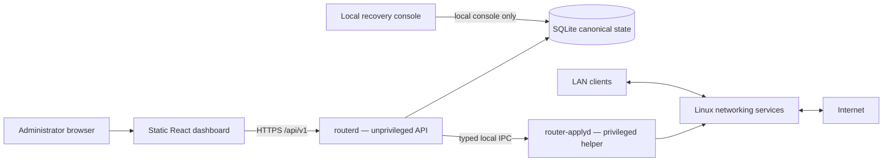

# Minimal Router OS

<p align="center">
  
</p>

<p align="center">
  <a href="#project-status"></a>
  <a href="https://github.com/vladimirperovic/minimalrouter/actions/workflows/ci.yml"></a>
  <a href="https://github.com/vladimirperovic/minimalrouter/actions/workflows/codeql.yml"></a>
  <a href="LICENSE"></a>
</p>

<p align="center">
  <a href="docs/INSTALLATION.md">Installation</a> ·
  <a href="docs/PROXMOX.md">Proxmox</a> ·
  <a href="docs/CURRENT_VALIDATION.md">Current validation</a> ·
  <a href="docs/DYNAMIC_DNS.md">Dynamic DNS</a> ·
  <a href="docs/README.md">Documentation</a> ·
  <a href="SECURITY.md">Security</a> ·
  <a href="ROADMAP.md">Roadmap</a>
</p>

<a id="project-status"></a>

> **Development status: early alpha.** Minimal Router OS is a research and
> homelab project. It has completed an initial owner-Proxmox real-Internet pilot
> with PPPoE, external WireGuard access and successful pfSense fallback, but it
> remains suitable only for a console-accessible controlled pilot with a
> known-good router ready for rollback. It is not yet a drop-in unattended
> replacement for pfSense, OpenWrt or a commercially supported firewall.

Minimal Router OS is a focused Alpine Linux router appliance with a Go control
plane and static React dashboard. Packet forwarding remains in the Linux kernel.
The project uses proven components rather than implementing a new packet stack:

- `nftables` for firewalling and NAT;
- `pppd` for PPPoE;
- `dnsmasq` for DHCP, DNS, filtering and bounded service sets;
- WireGuard for remote access;
- `inadyn` for No-IP or Cloudflare Dynamic DNS;
- optional Squid, QoS and Wi-Fi AP support.

## Current baseline

Implemented and covered in the development environment:

- unprivileged `routerd` plus narrow privileged `router-applyd`;
- SQLite canonical configuration state and migrations;
- typed validation and deterministic configuration generation;
- snapshot, preflight, apply, verification, commit-confirm and rollback;
- default-deny WAN policy and LAN-to-WAN NAT;
- PPPoE, DHCP, DNS, WireGuard, DNS Filter profiles and QoS;
- provider-aware Dynamic DNS through Alpine `inadyn`:
  - **No-IP is the default for new configurations**;
  - Cloudflare remains supported for backward compatibility;
  - legacy configs without a provider retain Cloudflare semantics;
- Argon2id authentication, secure sessions, CSRF, rate limiting and optional TOTP;
- encrypted backup export, configuration snapshots and local recovery console;
- crash-safe A/B update activation and rollback using a durable operation journal;
- signed manifests, SHA-256 verification, checksums, SPDX SBOMs and provenance;
- bounded local storage with disk-pressure fail-closed behavior and rotated logs;
- authenticated central appliance health covering recovery, storage, memory,
  conntrack, time, WAN/gateway, supervised services, DNS/DHCP, PPPoE, WireGuard,
  update state and encrypted-backup age;
- frontend unit tests and Playwright browser E2E;
- clean Alpine install, update/rollback CI, race tests, `vet`, `govulncheck`,
  CodeQL, secret scan, `gosec`, `shellcheck` and `actionlint`;
- benchmarks, fuzzing, ARM64 QEMU smoke tests and an isolated WAN-router-LAN
  namespace laboratory.

## 2026-08-01 owner-Proxmox pilot

The first real owner-Proxmox pilot additionally demonstrated:

- real PPPoE and Internet forwarding;
- **570 Mbps download / 327 Mbps upload** in the recorded sample;
- **0% packet loss** in the recorded 600-packet test;
- **200/200 DNS queries**;
- dashboard availability on **30/30** checks during the recorded 100% CPU load;
- **172 MB** observed RAM after the exercised workload;
- a real external phone **WireGuard handshake and dashboard access through the
  tunnel**;
- successful operational fallback to pfSense in approximately **93 seconds**.

The pilot also found an important Alpine kernel requirement. The tested
`linux-virt` guest did not provide the PPPoE kernel module required by the real
WAN path. Switching to **Alpine `linux-lts`** supplied the required support and
PPPoE succeeded. A clean `linux-lts` boot used approximately 73 MB RAM in that
session. Installers now fail closed unless `modprobe pppoe` succeeds.

The deployment uses **No-IP**. During the successful WireGuard test, DDNS was
provisioned manually on the Proxmox side; that proved the external endpoint and
WireGuard path but not the old Cloudflare-only appliance updater. The repository
now implements No-IP natively through `inadyn`. The next target-host gate is to
prove that MinimalRouter itself updates No-IP and follows a later public-IP
change without a host-side workaround.

See [`docs/CURRENT_VALIDATION.md`](docs/CURRENT_VALIDATION.md),
[`docs/PROXMOX_TEST_REPORT_2026-08-01.md`](docs/PROXMOX_TEST_REPORT_2026-08-01.md)
and [`docs/DYNAMIC_DNS.md`](docs/DYNAMIC_DNS.md) for exact scope and limitations.

## What remains unproven

Production readiness still requires recorded evidence for:

- stable WAN/LAN identity across repeated Proxmox and guest reboots;
- repeated real ISP PPPoE disconnect/reconnect and reboot recovery;
- MinimalRouter-managed No-IP update, service health, external DNS resolution and
  later public-IP-change propagation;
- WireGuard recovery after repeated PPPoE reconnect/reboot and broader traffic
  cases where required;
- sustained/repeated packet rate, CPU/IRQ, latency, jitter, loss and thermal
  behavior beyond the first throughput sample;
- external IPv4/IPv6 scanning;
- backup restore into a fresh VM;
- destructive full-disk, inode-exhaustion, read-only-filesystem, process-crash
  and power-loss fault injection;
- at least seven days of sustained operation;
- owner-qualified signed install/recovery media and independent security review.

## Architecture



Every configuration mutation follows the same invariant:

```text
input → validation → typed model → generation → preflight → snapshot
      → apply → verification → commit or rollback
```

Unsupported functionality fails closed or is shown as unavailable rather than
being simulated.

## Controlled installation

There is no signed stable ISO yet. Use a clean Alpine Linux 3.22 VM or dedicated
test system with two interfaces and local console access. For the validated
Proxmox PPPoE path use `linux-lts` and confirm:

```sh
modprobe pppoe
```

A failure is a hard stop.

Start with:

- [`docs/INSTALLATION.md`](docs/INSTALLATION.md)
- [`docs/PROXMOX.md`](docs/PROXMOX.md)
- [`docs/PROXMOX_TEST_REPORT_2026-08-01.md`](docs/PROXMOX_TEST_REPORT_2026-08-01.md)
- [`docs/DYNAMIC_DNS.md`](docs/DYNAMIC_DNS.md)
- [`docs/RECOVERY.md`](docs/RECOVERY.md)
- [`docs/TESTING.md`](docs/TESTING.md)
- [`docs/STORAGE_PRESSURE.md`](docs/STORAGE_PRESSURE.md)
- [`docs/APPLIANCE_HEALTH.md`](docs/APPLIANCE_HEALTH.md)

Keep the existing router available. Initial testing must use an isolated LAN and
a test/NAT WAN path. Never run two DHCP servers on the same production LAN.

Build an AMD64 development archive:

```sh
git clone https://github.com/vladimirperovic/minimalrouter.git
cd minimalrouter
pnpm --dir web install --frozen-lockfile
make dist-amd64
cd build
sha256sum -c minimalrouter-linux-amd64.tar.gz.sha256
```

A development archive is not a signed stable firmware release.

## Development

Requirements:

- the Go version declared in `go.mod`;
- Node.js 22;
- pnpm.

```sh
go test -race ./...
go vet ./...

pnpm --dir web install --frozen-lockfile
pnpm --dir web lint
pnpm --dir web test
pnpm --dir web build
pnpm --dir web exec playwright install chromium
pnpm --dir web test:e2e
```

Additional automated suites are defined in `.github/workflows/`.

## Security and privacy

A router is a security boundary. Read [`SECURITY.md`](SECURITY.md) before running
or changing privileged code. Do not report vulnerabilities in public issues.

Never commit or publicly attach:

- PPPoE credentials;
- administrator passwords, hashes, sessions or CSRF values;
- WireGuard private keys, preshared keys, profiles or QR codes;
- No-IP passwords/DDNS Keys or Cloudflare tokens;
- signing private keys;
- backups, databases, snapshots, packet captures or runtime logs;
- real public addresses, private hostnames, MAC addresses or device inventory.

The project does not intentionally include project-operated analytics,
advertising or cloud telemetry. See [`PRIVACY.md`](PRIVACY.md).

## Documentation

The complete index is [`docs/README.md`](docs/README.md). Key documents include:

- [`ARCHITECTURE.md`](ARCHITECTURE.md)
- [`PROJECT.md`](PROJECT.md)
- [`SECURITY.md`](SECURITY.md)
- [`docs/CURRENT_VALIDATION.md`](docs/CURRENT_VALIDATION.md)
- [`docs/INSTALLATION.md`](docs/INSTALLATION.md)
- [`docs/PROXMOX.md`](docs/PROXMOX.md)
- [`docs/PROXMOX_TEST_REPORT_2026-08-01.md`](docs/PROXMOX_TEST_REPORT_2026-08-01.md)
- [`docs/DYNAMIC_DNS.md`](docs/DYNAMIC_DNS.md)
- [`docs/TESTING.md`](docs/TESTING.md)
- [`docs/RECOVERY.md`](docs/RECOVERY.md)
- [`ROADMAP.md`](ROADMAP.md)
- [`CHANGELOG.md`](CHANGELOG.md)

## Releases

There is no stable signed release yet. Official releases must follow
[`docs/RELEASE_PROCESS.md`](docs/RELEASE_PROCESS.md) and
[`docs/RELEASE_SECURITY.md`](docs/RELEASE_SECURITY.md), publish signed manifests,
checksums, SPDX SBOMs, provenance, known limitations and the exact supported
deployment class.

## License

Minimal Router OS is available under the [MIT License](LICENSE).

The project name and documentation do not imply endorsement by Netgate, pfSense,
OpenWrt, No-IP, Cloudflare, Alpine Linux or any other referenced project or
company.
