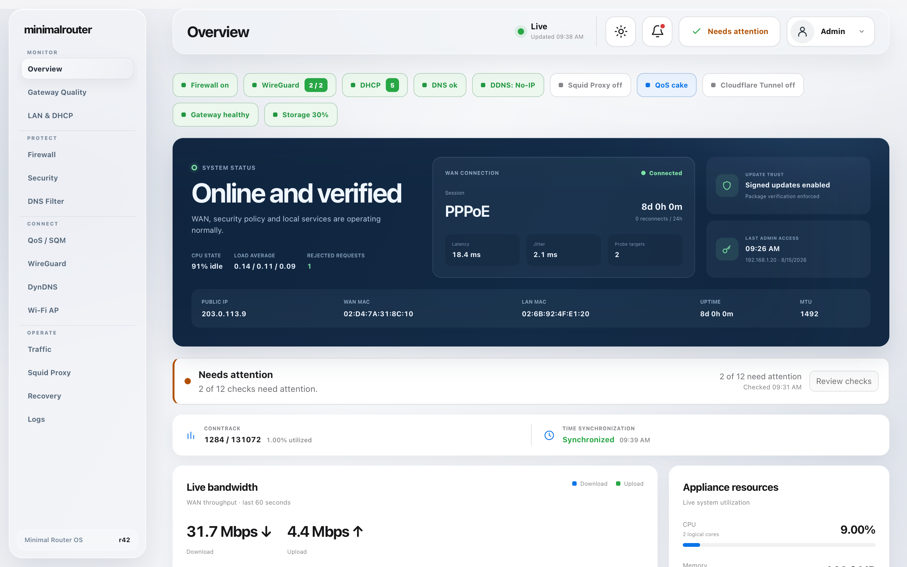

# Minimal Router OS

<p align="center">
  
</p>

<p align="center">
  <a href="#status"></a>
  <a href="https://github.com/vladimirperovic/minimalrouter/actions/workflows/ci.yml"></a>
  <a href="https://github.com/vladimirperovic/minimalrouter/actions/workflows/codeql.yml"></a>
  
  <a href="LICENSE"></a>
</p>

<p align="center">
  <a href="docs/INSTALLATION.md">Install</a> ·
  <a href="docs/PROXMOX.md">Proxmox</a> ·
  <a href="docs/CURRENT_VALIDATION.md">Validation</a> ·
  <a href="https://vladimirperovic.github.io/minimalrouter/">Live dashboard demo</a> ·
  <a href="docs/README.md">Docs</a> ·
  <a href="SECURITY.md">Security</a> ·
  <a href="ROADMAP.md">Roadmap</a>
</p>

<p align="center">
  <a href="https://vladimirperovic.github.io/minimalrouter/"></a>
</p>

<p align="center">
  <strong><a href="https://vladimirperovic.github.io/minimalrouter/">Try the interactive dashboard</a></strong><br />
  Browser-only demo with synthetic data; no sign-in or router connection required.
</p>

> The public demo runs entirely in the browser with synthetic documentation
> data. It does not connect to a router, expose a management API or contain real
> credentials, addresses or device information.

## A home router you can actually change

Most router platforms are built to cover every case anyone might ever have. That
makes them powerful, and it makes them large. Once you want something they do not
already do, you are reading through a system far too big to hold in your head.

Minimal Router starts from the other end. It does the handful of things a home
connection actually needs, and it stops there. There is no plugin catalogue, no
package manager, no third configuration language. The whole control plane is
about thirty thousand lines of Go, one React dashboard, and a set of plain Linux
services underneath.

That size is the point. It is small enough that you — with an AI coding agent
sitting beside you — can read all of it, understand why it behaves the way it
does, and change it to fit your house exactly. Not by finding the right checkbox.
By changing the code and shipping your own build.

If you have ever wanted a router that works the way *you* want rather than the
way a settings page allows, that is what this is for.

<a id="status"></a>

> **Beta.** The core is carrying real PPPoE traffic in a validated Proxmox
> deployment: DHCP/DNS, NAT, WireGuard, Dynamic DNS, gateway monitoring,
> snapshots and recovery all work end to end. Signed A/B update and release
> tooling are implemented; the remaining release gates are real-lab/endurance
> evidence and independent validation. Local-console recovery remains the
> deliberate safety path. See
> [`docs/CURRENT_VALIDATION.md`](docs/CURRENT_VALIDATION.md) for exactly what is
> proven today and what is not.

## Why it is easy to adapt

**One place per decision.** Firewall rules come from one generator. Everything
the appliance applies comes from one config struct, through one transaction. When
you want to change behaviour, there is usually a single function to read.

**The rules are written down as tests, not as folklore.** Things like "routing is
never switched on before the firewall is loaded" or "port forwards are never
reachable from the WAN" are enforced by tests that fail loudly if a change breaks
them. An agent editing this code gets told immediately when it has crossed a line
that matters — which is exactly what makes it safe to let one work here.

**Nothing hidden behind a vendor abstraction.** Packet forwarding is Linux.
The project drives `nftables`, `pppd`, `dnsmasq`, WireGuard and `inadyn` directly.
If you know Linux networking, you already know most of this system.

**Honest reporting.** The dashboard never shows green for something it did not
measure. If a check could not be read, it says so. That habit makes the appliance
far easier to reason about when you are changing it.

### Working with an AI agent

Clone the repository, open it with your agent of choice, and describe what you
want in plain language: *"add a schedule that blocks the kids' tablet during
school hours"*, *"send me an alert when the WAN drops"*, *"cap the guest network
to 20 Mbps"*.

Useful things to point an agent at first:

- [`ARCHITECTURE.md`](ARCHITECTURE.md) — how the pieces fit together
- [`DESIGN.md`](DESIGN.md) — the rules the project holds itself to
- [`SECURITY.md`](SECURITY.md) — read before touching anything privileged
- `internal/config/validation.go` — what a valid configuration is
- `internal/services/nftables.go` — every firewall rule the router ever loads

Then run the tests. If they pass, your change kept the safety properties. If they
fail, the message tells you which one you broke and why it exists.

## What it does

- PPPoE WAN, DHCP/DNS, NAT and a default-deny firewall
- WireGuard remote access with peer provisioning
- Dynamic DNS via No-IP or Cloudflare
- gateway latency, loss and reconnect monitoring with live bandwidth
- connected-device list, DHCP reservations and Wake-on-LAN
- per-device monthly traffic accounting
- DNS filtering with per-device schedules, and a non-caching Squid proxy
- QoS/SQM shaping with CAKE or fq_codel
- optional Wi-Fi access point on supported hardware
- transactional configuration with confirmation, rollback and recovery
- encrypted backups, snapshots and crash-safe A/B updates

Deliberately **not** included: multi-WAN, BGP/OSPF, IDS/IPS, captive portals,
HA failover, a plugin system. If you need those, use a platform built for them.

## Small enough to run anywhere

The validated appliance runs the full core stack on **2 vCPUs and 512 MiB RAM**.
1 GiB is comfortable once you enable more optional services.

## Quick start

Build an installable archive:

```sh
git clone https://github.com/vladimirperovic/minimalrouter.git
cd minimalrouter
pnpm --dir web install --frozen-lockfile
make dist-amd64
cd build
sha256sum -c minimalrouter-linux-amd64.tar.gz.sha256
```

Install on a clean Alpine 3.22 VM. Check PPPoE kernel support first — the
`linux-virt` kernel does not ship the module, `linux-lts` does:

```sh
modprobe pppoe
```

```sh
tar xzf minimalrouter-linux-amd64.tar.gz
cd minimalrouter-linux-amd64
sudo sh install.sh
```

For an air-gapped VM with dependencies already present, `sudo sh install.sh
--offline` verifies packages with `apk info -e` instead of installing them, and
aborts if anything is missing.

Then open the address the installer prints and the setup wizard walks you through
WAN/LAN roles, PPPoE and the administrator password.

Full instructions: [`docs/INSTALLATION.md`](docs/INSTALLATION.md) and
[`docs/PROXMOX.md`](docs/PROXMOX.md).

## Development

Requirements: Go (version pinned in `go.mod`), Node.js 22 and pnpm.

```sh
go test -race ./...
go vet ./...
pnpm --dir web install --frozen-lockfile
pnpm --dir web lint
pnpm --dir web test
pnpm --dir web build
pnpm --dir web test:e2e
```

CI additionally covers a clean Alpine install, update and rollback, fuzzing,
CodeQL, secret scanning, ARM64 under QEMU, network-namespace routing labs and
performance checks.

## Documentation

- [`docs/README.md`](docs/README.md) — documentation index
- [`docs/CURRENT_VALIDATION.md`](docs/CURRENT_VALIDATION.md) — what is proven now
- [`docs/INSTALLATION.md`](docs/INSTALLATION.md) — install and offline install
- [`docs/PROXMOX.md`](docs/PROXMOX.md) — VM baseline and safe pilot procedure
- [`docs/DYNAMIC_DNS.md`](docs/DYNAMIC_DNS.md) — No-IP and Cloudflare
- [`docs/RECOVERY.md`](docs/RECOVERY.md) — recovery and rollback
- [`docs/TESTING.md`](docs/TESTING.md) — test strategy and manual gates
- [`ARCHITECTURE.md`](ARCHITECTURE.md) — architecture details

## Security and privacy

A router is a security boundary. Read [`SECURITY.md`](SECURITY.md) before changing
privileged code, and report vulnerabilities privately.

Never commit real credentials, private keys, backups, databases, packet captures,
public addresses, private hostnames, MAC addresses or a household device
inventory. See [`PRIVACY.md`](PRIVACY.md).

## License

MIT — see [`LICENSE`](LICENSE).
