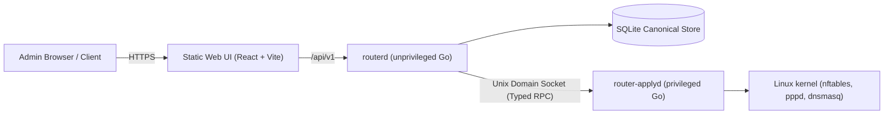

# Minimal Router OS — Go Backend Implementation Plan

## Architectural Summary

Minimal Router OS separates the control plane (Go management services) from the data plane (Linux kernel, nftables, pppd, dnsmasq).

- **`routerd`**: Unprivileged Go process managing HTTPS, REST API (`/api/v1`), SQLite canonical store, transaction planning, snapshots, and audit logging.
- **`router-applyd`**: Restricted privileged Go process communicating with `routerd` via a root-owned Unix domain socket (`SO_PEERCRED`). Responsible only for allowlisted operations (generating service files, loading nftables, reloading allowlisted services).



---

## Configuration Decisions (v1 Baseline)

- **Alpine Linux**: Pinned to stable branch `3.22`
- **Go Version**: `1.25`
- **Certificate Strategy**: Self-signed TLS bootstrap for initial v1 setup
- **Implemented Integrations**: WireGuard, Cloudflare DDNS through `inadyn`,
  and Wi-Fi AP through `hostapd` on compatible hardware.
- **Deferred Integrations**: Cloudflare Tunnel, DoH, per-device DNS policy,
  and automatic updates.
- **Primary Core Focus**: Scaffolding, SQLite canonical store, Apply State Machine, `router-applyd` Unix socket IPC, REST API, `nftables` generator, `pppd` generator, `dnsmasq` generator, LAN/DHCP commit-confirmed safety.

---

## Phase 1: Foundation & Go Scaffolding

### 1.1 Repository Structure
Scaffold standard Go directory layout per `ARCHITECTURE.md`:

```text
/
├── cmd/
│   ├── routerd/
│   │   └── main.go
│   └── router-applyd/
│       └── main.go
├── internal/
│   ├── api/          # REST endpoints & OpenAPI handlers
│   ├── auth/         # Argon2id password hashing, sessions, CSRF
│   ├── config/       # Domain models, schema, cross-field validation
│   ├── planner/      # Transaction planning & diff generator
│   ├── apply/        # State machine, crash recovery, Unix socket IPC
│   ├── platform/     # Linux service adapters
│   ├── services/     # nftables, pppd, dnsmasq config generators
│   ├── snapshots/    # Immutable snapshot & recovery management
│   └── telemetry/    # Structured JSON logger & audit events
├── api/
│   └── openapi.yaml  # Version 1 OpenAPI specification
├── migrations/       # SQLite schema migration files
└── Makefile          # Task runner (bootstrap, generate, test, build)
```

### 1.2 Go Module & Dependencies
Initialize `go.mod` (Go 1.25):
- `modernc.org/sqlite` or `github.com/mattn/go-sqlite3` (CGO-free / embedded SQLite)
- `golang.org/x/crypto/argon2` (Argon2id hashing)
- Standard Go HTTP / router (`net/http`)

---

## Phase 2: Configuration Engine & IPC

### 2.1 Domain Model & Validation (`internal/config`)
- Strongly-typed models for System, PPPoE WAN, LAN Interface, DHCP Server, Static Leases, Firewall Rules & Port Forwards.
- Cross-field validation (e.g. WAN IP vs LAN subnet separation, valid port ranges, CIDR checks).

### 2.2 Canonical SQLite Store (`internal/config/store.go`, `migrations/`)
- Versioned configuration schema.
- Optimistic concurrency (revision checks / ETag).
- Immutable snapshot creation before applies.

### 2.3 Generators (`internal/services/`)
- `nftables`: Generates atomic `minimalrouter` table ruleset.
- `pppd`: Generates `/etc/ppp/peers/wan` and `/etc/ppp/chap-secrets`.
- `dnsmasq`: Generates `/etc/dnsmasq.d/minimalrouter.conf`.

### 2.4 Apply State Machine & Privileged Helper (`internal/apply`)
- Serialized apply queue (1 transaction at a time).
- State transitions: `Received → Planned → Generated → Snapshotted → Applied → Verified → Committed` (or `RolledBack`).
- Unix Domain Socket RPC between `routerd` and `router-applyd`.

---

## Phase 3: REST API & Authentication (`internal/api`, `internal/auth`)

- Base path `/api/v1`
- `/auth/login`, `/auth/logout`, `/auth/session`
- `/system`, `/internet`, `/lan`, `/dhcp`, `/firewall`
- Argon2id password verification, HTTP-only secure cookies, CSRF protection, rate-limiting.

---

## Verification & Safety

- **Unit tests**: `make test` for config generators, validation rules, state machine transitions.
- **Rollback Safety**: Commit-confirmed timeout for LAN address changes.
- **Static UI**: `web/src/App.tsx` builds to `web/dist/`; the appliance has no
  Node.js runtime.
